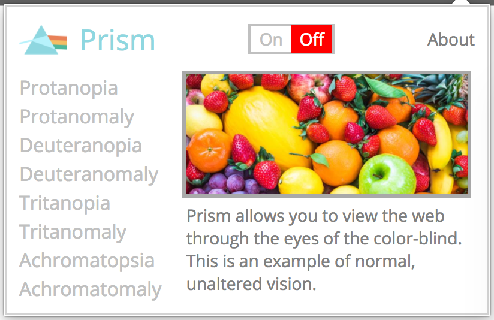

# Prism



Prism is a Chrome extension that simulates color-blindness when browsing the web. Users are able to select one of four different types of color-blindness in two degrees each (e.g., Protanopia and Protanomaly), effectively filtering all text, images, videos, backgrounds, and buttons on the current page.

The extension utilizes the following:

- Vanilla JavaScript
- jQuery
- HTML and CSS
- Scalable Vector Graphics (SVG)

# Features


Current features of the Prism include:

- [X] An open-source Chrome extension
- [X] Eight selectable filters to simulate a particular type of color-blindness
- [X] Detailed previews and descriptions of each color-blindness
- [X] Storage of the previously-chosen filter
- [X] An on/off switch

### Interactions between extension (popup) and page content

The primary goal of the Popup scripts (popup.js) is to send requests to the extension's Content scripts (content.js). As the user selects a pre-defined filter in the popup page, this option is captured and passed along to another part of our extension.

```javascript
const setFilter = (image, filter) => {
  setActive(filter);

  // capturing the user-selected filter
  let filterDes = document.getElementById('filter-description');
  filterDes.innerHTML = descriptions[filter];

  // filtering the popup.html page
  let filterURL = `url('#${filter.toLowerCase()}')`;
  image.style.filter = filterURL;

  // sending the request (a POJO with an action and 'type' payload) to the Content scripts
  chrome.tabs.getSelected(function(tab){
    chrome.tabs.sendMessage(tab.id, {
      action: 'render',
      type: filter
    });
  });
};
```

In turn, these Content scripts inject code directly into the web page, achieving the desired filter effects.

```javascript
chrome.runtime.onMessage.addListener(
  function(message, sender, sendResponse){
    if( message.action === 'render' && message.type !== ''){
      addFilter(message.type);
      sendResponse(true);
    }
    else {
      revertColors();
      sendResponse(true);
    }
  }
);
```

<!-- First, an SVG script containing all color filters is injected directly into the page. These filters are represented by the Color Matrix Library, whose values are customized to simulate a particular type of color-blindness (e.g., Deuteranopia, Deuteranomaly, etc.).

As a user selects a type of color-blindness, Prism modifies the page by calling CSS’ built-in filter property, which provides graphical effects to elements of the page. Using a url value that points to the user-selected filter from the SVG script, Prism then applies styling to all elements of the page: text, images, videos, backgrounds, and buttons alike. -->
